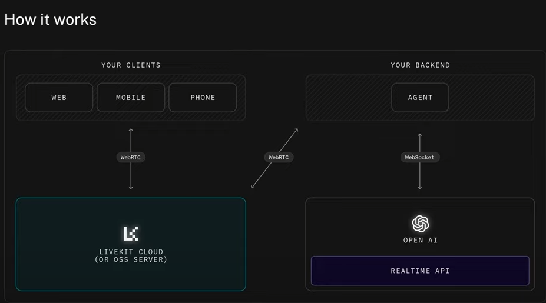

<<<<<<< HEAD
# AI Voice Assistant for Car Service Scheduling

A multimodal voice assistant powered by LiveKit, OpenAI, and Google Calendar. This assistant listens to voice input, identifies car-related intents (like VIN lookup, profile creation, and scheduling), and responds in real-time with both text and speech.



---

## Features

- 🎙 Voice-based car assistant (VIN lookup, create profile, get details)
- 📅 Google Calendar integration for service scheduling
- 🧠 LLM (OpenAI) does intent + entity extraction
- 💾 SQLite DB for storing car records
- 🔊 Works via LiveKit + OpenAI for real-time interaction

---

## Project Structure

```
backend/
├── agent.py                 # LiveKit agent entrypoint
├── api.py                   # Assistant logic (LLM tools)
├── db_driver.py             # SQLite handler
├── prompts.py               # Prompt templates
├── google_calendar.py       # Calendar integration
├── server.py                # LiveKit token generator (Flask)
├── auto_db.sqlite           # Database file
├── view_cars.py             # View all car entries
├── clear_cars.py            # Delete all car records
├── test_calendar.py         # Standalone Google Calendar tester
├── requirements.txt         # Python dependencies
└── .env                     # API keys and secrets
```

---

## Setup Instructions

### 1. Clone and create a virtual environment
```bash
cd backend
python -m venv ai
ai\Scripts\activate  # or source ai/bin/activate on mac/linux
```

### 2. Install dependencies
```bash
pip install -r requirements.txt
```

### 3. Add `.env` file
```env
LIVEKIT_URL=wss://...
LIVEKIT_API_KEY=...
LIVEKIT_API_SECRET=...
OPENAI_API_KEY=sk-...
```

### 4. Add Google API Credentials
Place your downloaded `credentials.json` (OAuth client) into `backend/`

---

## Running the System

### 🧠 1. Start the LiveKit assistant agent:
```bash
python agent.py
```

### 🌐 2. Run the token server (optional)
```bash
python server.py
```

---

## How to Use It

### 🗣 Voice Instructions:
- "My VIN is ABC123"
- "Create a new profile for a Honda Civic 2019"
- "What’s the model again?"
- "Schedule a service for May 5 at 10 AM for oil change"

### 🧠 Behind the scenes:
- The LLM extracts intent/entities
- Calls functions like `lookup_car()`, `create_car()`, `get_car_details()`
- Triggers `schedule_service()` from `google_calendar.py`

---

## Testing & Utilities

### ✅ Test Google Calendar manually:
```bash
python test_calendar.py
```

### 🧼 Clear DB:
```bash
python clear_cars.py
```

### 🔎 View DB:
```bash
python view_cars.py
```

---

## Suggestions & Future Improvements

- ✅ Add user authentication + session tracking
- 📆 Natural language time parsing ("next Friday at 3 PM")
- 🔁 Update & delete car profiles
- 📦 Dockerize for easy deployment
- 🖥 Simple frontend for testing & visualization

---

## Credits
Built by Sachin Dhital using OpenAI, LiveKit, and Google Cloud Platform APIs.
=======
# AI-VOICE_-AGENT
>>>>>>> 54263aa2f44c59d0a58ab63526f355053a2ffc62
